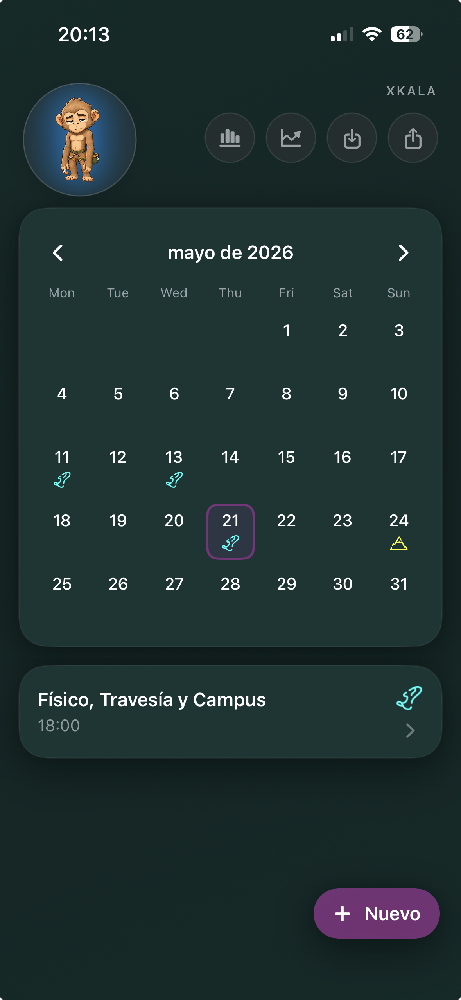
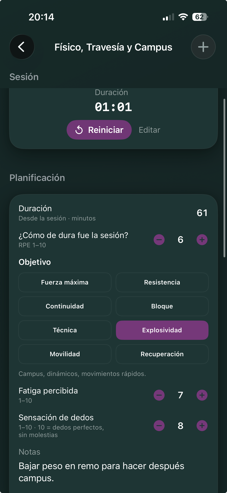
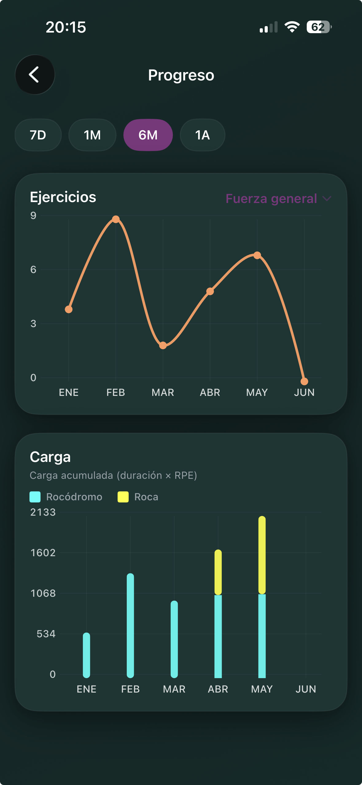

# Xkala

App iOS para escaladores centrada en registrar entrenamientos y entender la evolución del rendimiento.

Desarrollada con **SwiftUI** y **SwiftData**, Xkala permite registrar sesiones de entrenamiento, ejercicios y métricas de forma rápida durante el entrenamiento.

El objetivo del proyecto es evolucionar desde un simple registro de entrenamientos hacia una herramienta que ayude al escalador a visualizar su progreso, detectar mejoras y tomar mejores decisiones de entrenamiento.

  
  
  

## Funcionalidades actuales

- creación de entrenamientos
- catálogo de ejercicios
- ejercicios por repeticiones o tiempo
- soporte opcional para carga (kg)
- registro de series, intensidad y notas
- estadísticas básicas de progreso
- persistencia local con SwiftData

## Roadmap

Próximas líneas de trabajo:

- métricas avanzadas de progreso
- evolución histórica
- tests de rendimiento
- exportación e importación de datos
- planificación de entrenamiento
- análisis específico para escalada

## Modelo de datos

La app se basa en cuatro entidades principales:

- WorkoutDay — sesión de entrenamiento
- Exercise — definición del ejercicio
- WorkoutEntry — ejercicio dentro de un entrenamiento
- SetRecord — datos de cada serie

Relación simplificada:

WorkoutDay
└── WorkoutEntry
└── SetRecord

Exercise
└── WorkoutEntry

## Tecnologías

- SwiftUI
- SwiftData
- iOS

## Estado del proyecto

Versión actual: v0.1.0

Proyecto personal en desarrollo activo.

Actualmente utilizado y validado en dispositivo real.

## Testing en iPhone

Actualmente Xkala no está distribuida mediante TestFlight.

Para ejecutarla es necesario:

- Mac
- Xcode
- iPhone
- Apple ID

Pasos:

1. Clonar el repositorio
2. Abrir el proyecto en Xcode
3. Seleccionar tu Apple ID en Signing & Capabilities
4. Ejecutar la app en tu dispositivo

Nota: con una cuenta gratuita de Apple las builds expiran cada 7 días.

## Feedback

Estoy buscando escaladores que quieran probar la app y aportar feedback sobre:

- experiencia de uso
- métricas útiles
- mejoras de producto
- funcionalidades que echan de menos

Las sugerencias e issues son bienvenidos.

## License

Xkala es software source-available.

El código fuente se publica para evaluación, pruebas y feedback.

No se permite redistribución, uso comercial ni creación de trabajos derivados sin autorización expresa del autor.

Copyright © 2026 Alejandro Laso Gómez. All rights reserved.

## Autor

Alejandro Laso Gómez

GitHub: @ben16dev

## Feedback

Si eres escalador y pruebas la app, cualquier sugerencia o issue es bienvenida.
